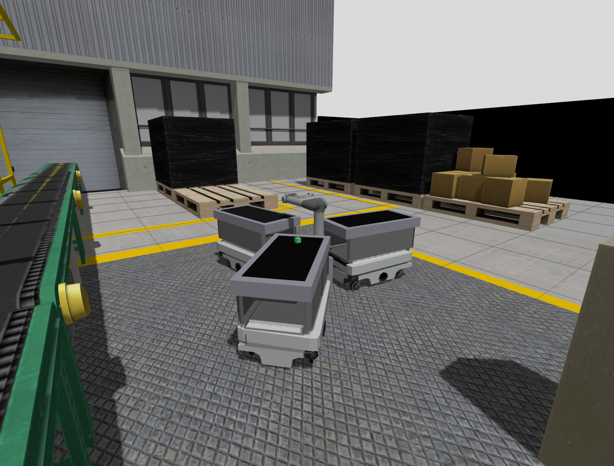
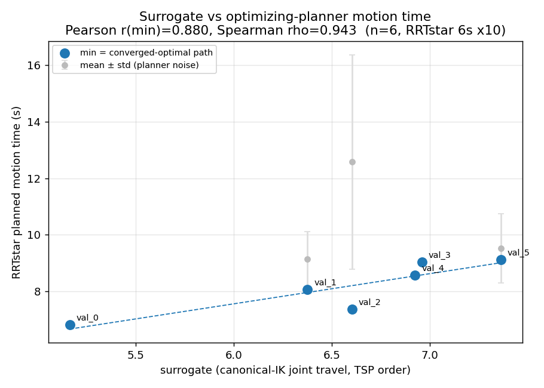
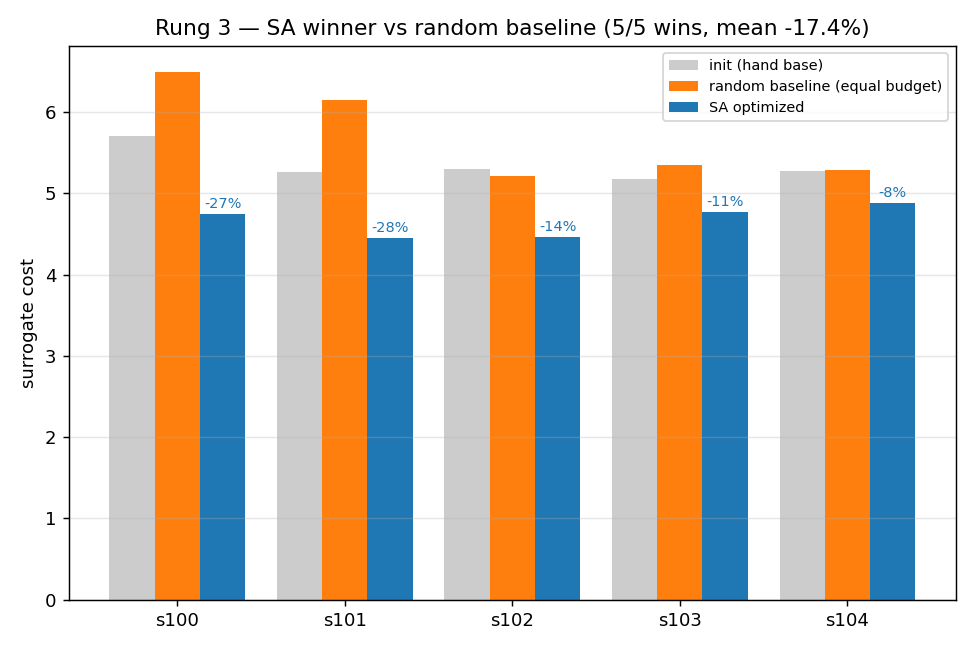

# Reconfigurable Cell Digital Twin

**A ROS 2 + Gazebo digital twin of a reconfigurable warehouse pick-and-place cell, driven by a deterministic surrogate that predicts real robot motion time well enough to optimize station layouts *without* simulating every candidate.**

<p align="center">
  
</p>

<p align="center">
  
  
  
  
</p>

## What this is

Evaluating a candidate layout for a robotic pick-and-place cell normally means running a sampling-based motion planner in a high-fidelity simulator — slow, and stochastic enough that you need repeated trials to trust a single number. This project instead searches station poses and visit order against a **deterministic joint-travel surrogate** (<0.0003% run-to-run spread), and separately validates that the surrogate honestly predicts real planned motion in the digital twin.

The result: a declarative framework where a cell *configuration* (station count, poses, robot base pose, visit order) is data, not code — the same scene-manager and task-executor nodes run any generated config unmodified, and an optimizer can search the configuration space in milliseconds per candidate instead of minutes.

## Key results

| Finding | Value |
|---|---|
| Surrogate ↔ real motion-time correlation | Pearson r = 0.880, Spearman ρ = 0.943 (n = 6) |
| Simulated annealing vs. random baseline (surrogate) | wins 5/5 seeds, mean −17.4% |
| Gain transfers to real planned motion | −19% |
| Generalizes across | 50 seeds × 2 arms (UR5, UR10) |
| Robot base pose under the cycle-time objective | cost-neutral (free to reposition) |

<p align="center">
  
  
</p>

The correlation only holds once the measurement matches what the surrogate actually models: an *optimizing* planner (RRT\*) run to convergence, joint-to-joint kinematic continuity between waypoints, and a fixed visit order. Against a randomized feasibility planner there is no reliable correlation — that negative result is in the write-up too.

## How it works

A cell configuration is generated, validated, and executed by a small set of config-agnostic ROS 2 packages:

| Package | Role |
|---|---|
| `cell_generator` | Synthesizes a scene + task from a configuration spec |
| `cell_scene_manager` | Applies the generated MoveIt scene and runs an IK reachability guard |
| `cell_task_executor` | Executes the generated task (pick/place with a `DetachableJoint` grasp) — config-agnostic |
| `cell_synth` | Auto-synthesizes valid configurations by reusing the IK guard as a validity oracle (headless, no Gazebo/GL) |
| `cell_bringup` | Launch files: UR5/UR10 + RG2 in Gazebo, MoveIt 2, and the framework nodes above |
| `cell_description` / `cell_gripper_description` | Robot and gripper xacro/URDF |

Optimization (simulated annealing, and a five-way comparison against GA / CMA-ES / BO / PSO) runs entirely against the surrogate — see `opt_out*/`, `opt_compare/`, and `phase3_*/` for the scaled-up and cross-arm experiments, and `val_*/` / `demo_gate/` for the surrogate-vs-real validation runs.

## Quick start

Requires ROS 2 Jazzy + Gazebo Harmonic (Ubuntu 24.04) and MoveIt 2.

```bash
colcon build
source install/setup.bash

# Bring up a generated configuration end-to-end (Gazebo + MoveIt + framework nodes)
ros2 launch cell_bringup cell_warehouse.launch.py config:=config_1
ros2 launch cell_bringup cell_warehouse.launch.py config:=config_2
```

Switching `config:=config_1` → `config:=config_2` changes station layout, conveyor set, and task purely through the generated config — no code changes.

## Paper

A submission draft describing the surrogate, its validation, and the optimizer comparison lives in [`src/reconfig_cell/paper/`](src/reconfig_cell/paper/) (`main_ieee.tex`).
